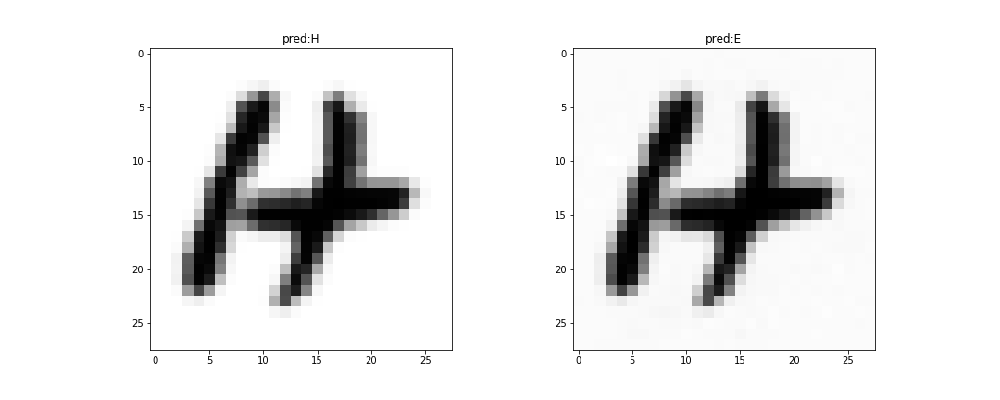

# NNfooling
Fooling the prediction of trained CNN

## Dataset:
[EMNIST](https://www.nist.gov/itl/iad/image-group/emnist-dataset)

## Dependancies:
* Python (>= 3.5)
* NumPy (>= 1.8.2)
* Pandas
* Tensorflow (1.1.0)
